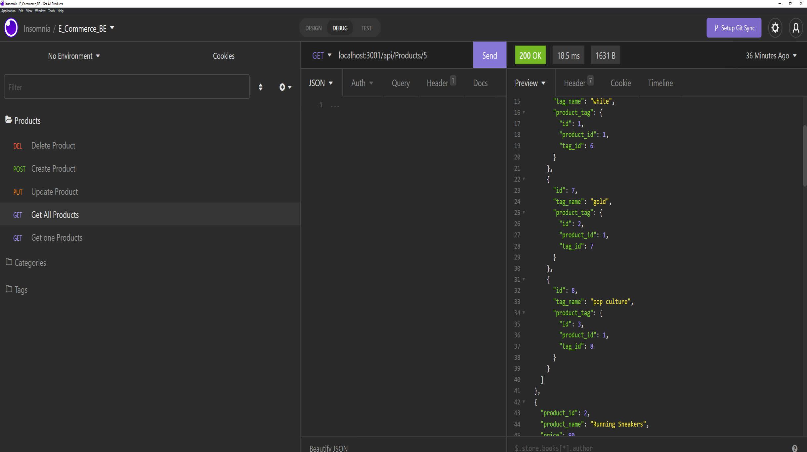

# E_Commerce_BE

## License
[](https://opensource.org/licenses/MIT)

## Table of Contents
- [Project Description](#project-description)  
- [Installation Information](#installation-information)  
- [Usage Information](#usage-information)  
- [Test Instructions](#test-instructions)  
- [Contributors on this Project](#contributors-on-this-project)  
- [Contact Information](#contact-information)  
  
## Project Description
- The E-commerce Back End System was created to support the operation of an online store. The system has a database that contains different tables with the product description, price, quantity, categories, and info tags. The user can retrieve, add, modify or delete data as required.
  
## Installation Information
- Load the ``schema.sql`` to create the database and tables. At the root directory, open a mysql console and run the follwing command: ``SOURCE db/schema.sql``;

- Load the database by executing the following command ```npm run seed```.
   
- To execute the script, open a Git terminal on the main project folder (cloned folder) Run the following command: ```npm start```.
  
## Usage Information
- Here is a link to the Demo Video https://youtu.be/Gfdb6XHCUsk
- 

## Contributors on this Project
- None other than RHoward1
- *[Contribution Guidlines](https://github.com/github/docs/blob/main/CONTRIBUTING.md)*
  
## Test Instructions
- None

## Questions

- If you have any questions about the repo, open an issue or contact me on Github or by Email.
### Contact Information
- Github [Rhoward1](https://github.com/Rhoward1)
  - Email at ryanmhoward.dev@gmail.com


## License Statement
- This application is covered by the [](https://opensource.org/licenses/MIT) license.
- Visit [MIT](https://opensource.org/licenses/MIT) for more information.
